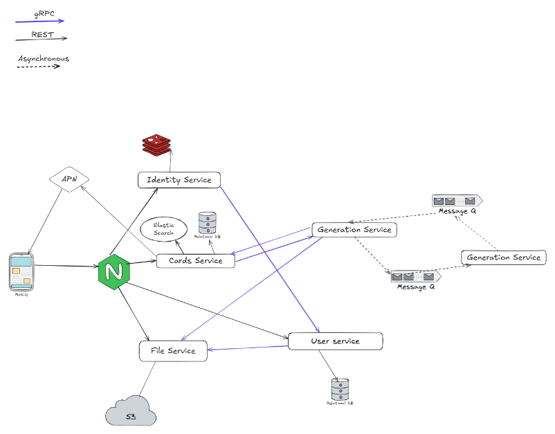

# About 
Karto4ki is an iOS flashcards app inspired by modern learning tools and built to help users retain knowledge more effectively.
The key differentiator is AI-assisted content creation: users can generate high-quality flashcards from learning materials and study them with a structured repetition flow.

# Architecture


Watch [`api`](./api) folder for **API specifications** and project-scope standards 

# Quick start
## Clone repository

```bash
git clone https://github.com/karto4ki/karto4ki-backend.git
```

## Setup certifications

```bash
mkdir -p ssl
openssl genrsa -out ssl/self-signed.key 2048
openssl req -new -x509 -key ssl/self-signed.key -out ssl/self-signed.crt -days 365
```

## Setup keys

```bash
mkdir -p keys
openssl genrsa -out keys/rsa 2048
openssl rsa -in keys/rsa -pubout -out keys/rsa.pub
openssl rand -hex 64 | tr -d '\n' > keys/sym
```

## Build and run services
```bash
docker compose up --build
```